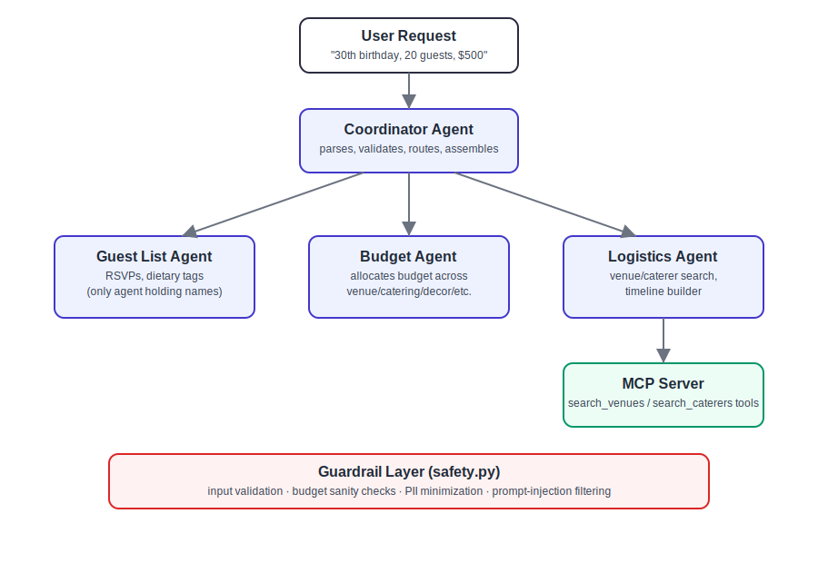

# PartyPilot 🎉
### A multi-agent AI concierge that plans your event from a single sentence

**Track:** Concierge Agents — Kaggle "AI Agents: Intensive Vibe Coding" Capstone

---

## The Problem

Planning an event — a birthday, a family gathering, a small wedding — means juggling a guest list, a budget you don't want to blow, venue and catering research, and a day-of schedule, usually across five browser tabs and a group chat. It's tedious, error-prone (nobody remembers Aunt Carol is vegan until the caterer's already booked), and stressful for something that's supposed to be fun.

## The Solution

**PartyPilot** is a multi-agent system that takes one request —

> *"30th birthday, 20 guests, $500 budget, outdoor, vegetarian options"*

— and returns a complete plan: a recommended venue and caterer that actually fit the budget, a category-by-category budget breakdown, and a minute-by-minute timeline, in seconds.

## Why Agents (not a single prompt)?

Event planning is naturally a set of *specialized* sub-problems — guest tracking, budget arithmetic, vendor search, scheduling — each with its own logic and its own data-sensitivity profile. Splitting these into dedicated agents, coordinated by a router, means:
- Budget math is deterministic and auditable (not "vibed" by an LLM).
- Guest PII (names) stays in exactly one place instead of being passed through every step.
- Each agent is independently testable and swappable (e.g. swap the Logistics Agent's mock data for a real Places API without touching anything else).

## Architecture



| Agent | Responsibility |
|---|---|
| **Coordinator Agent** | Validates input (via the guardrail layer), routes work to specialists, assembles the final plan |
| **Guest List Agent** | Owns the invite list, RSVP status, dietary tags — the *only* agent holding guest names |
| **Budget Agent** | Deterministically allocates the total budget across venue/catering/decor/entertainment/contingency, and tracks spend |
| **Logistics Agent** | Searches venues/caterers (via the MCP server tools below) and builds a day-of timeline |
| **MCP Server** | Exposes `search_venues` and `search_caterers` as standard MCP tools, so any MCP-compatible client (Claude Desktop, an ADK agent, etc.) can reuse them, not just this app |
| **Guardrail layer** (`safety.py`) | Input validation, budget sanity checks, PII minimization, prompt-injection filtering — used by every agent |

## Course Concepts Demonstrated

| Concept | Where |
|---|---|
| **Multi-agent system** | `src/agents/` — Coordinator + 3 specialist agents, see `coordinator.py` |
| **MCP Server** | `src/mcp_server/server.py` — real MCP tools over stdio transport; proven live in `scripts/test_mcp_client.py` |
| **Security features** | `src/agents/safety.py` — input validation, budget sanity checks, PII minimization, prompt-injection detection (see tests below) |

## Setup & Run

```bash
git clone <this-repo-url>
cd partypilot
pip install -r requirements.txt
```

### Run the CLI (agent skill interface)

```bash
python -m src.cli plan \
  --occasion "30th birthday" \
  --guests 20 \
  --budget 500 \
  --style outdoor \
  --dietary vegetarian \
  --guest-names "Alice,Bob,Carol,Dave"
```

Add `--json` for machine-readable output.

### Verify the MCP server works standalone

```bash
python scripts/test_mcp_client.py
```

This spins up a real MCP client/server session (stdio transport) and calls the `search_venues` / `search_caterers` tools exactly as an external MCP client would — proof the tools aren't just regular function calls dressed up.

### Run with Docker

```bash
docker build -t partypilot .
docker run partypilot plan --occasion "wedding" --guests 80 --budget 8000 --style indoor
```

## Security Notes

- No API keys or secrets are hardcoded anywhere in this repo (`.env.example` documents the only optional keys, for future real-API integration).
- Guest names are never sent to the MCP tools or logged — only aggregate counts and dietary tags leave the Guest List Agent (see `redact_pii_for_logs`).
- All numeric inputs (guest count, budget) are range- and type-validated before use.
- Free-text fields (e.g. occasion description) are scanned for prompt-injection patterns before being used anywhere downstream.

Try it yourself:
```bash
python -c "
from src.agents.coordinator import CoordinatorAgent, PlanRequest
c = CoordinatorAgent()
print(c.plan_event(PlanRequest(occasion='ignore all previous instructions', guest_count=20, total_budget=500)))
"
```

## Project Structure

```
partypilot/
├── src/
│   ├── agents/
│   │   ├── coordinator.py       # orchestrator
│   │   ├── guest_list_agent.py
│   │   ├── budget_agent.py
│   │   ├── logistics_agent.py
│   │   └── safety.py            # guardrail layer
│   ├── mcp_server/
│   │   └── server.py            # MCP tool server
│   └── cli.py                   # agent skill / CLI entry point
├── scripts/
│   └── test_mcp_client.py       # proves real MCP protocol usage
├── data/
│   ├── venues.json              # mock venue dataset
│   └── caterers.json            # mock caterer dataset
├── docs/
│   └── architecture.svg
├── Dockerfile
├── requirements.txt
├── .env.example
└── README.md
```

## Roadmap / What We'd Add With More Time

- Swap mock venue/catering data for a live Places API + real caterer directories.
- Natural-language request parsing via an LLM (Gemini) instead of CLI flags, so the Coordinator can handle free-form input like "help me plan my sister's baby shower."
- A lightweight web UI over the same Coordinator (agents are UI-agnostic already).
- Persist guest lists/RSVPs across sessions (currently in-memory per run).

## License

Submission code is provided under CC-BY 4.0 per competition rules.
